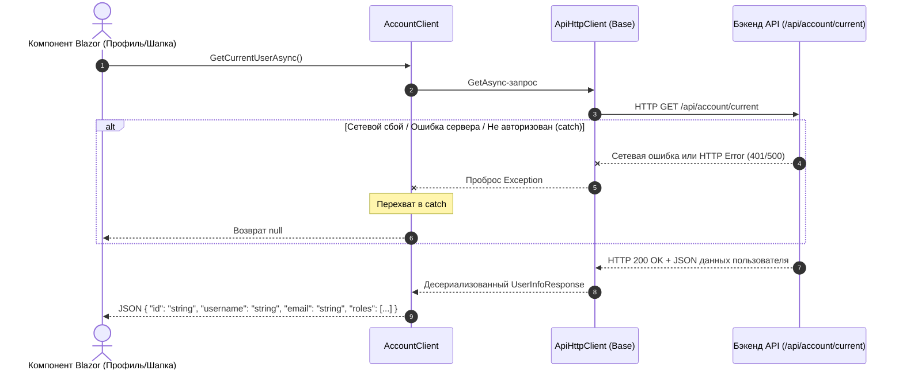
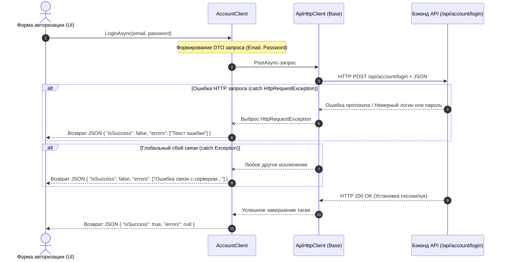
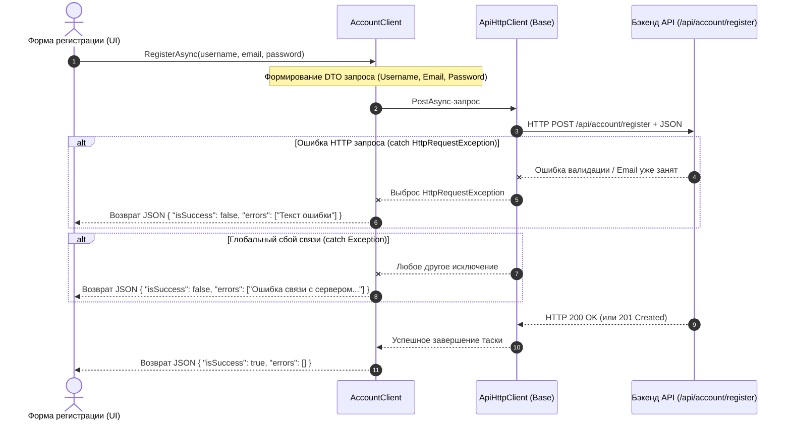
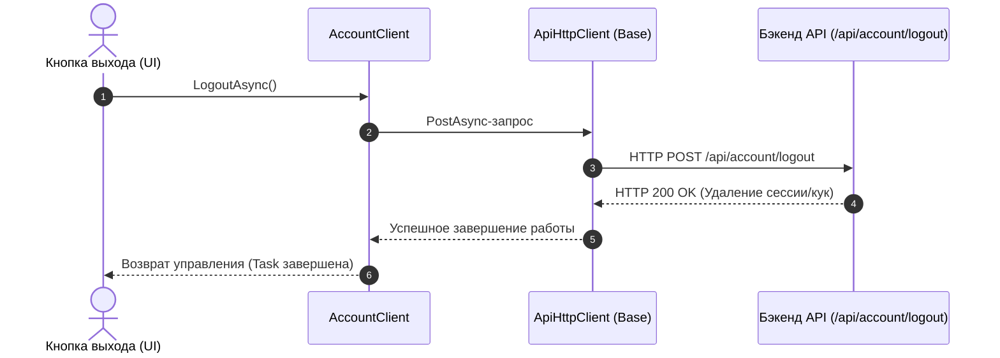

# Управление аккаунтом (Account API)

### 1. Получение текущего пользователя (GET /api/account/current)

### 2. Авторизация пользователя (POST /api/account/login)

### 3. Регистрация пользователя (POST /api/account/registration)

### 4. Выход из аккаунта (POST /api/account/logout)

