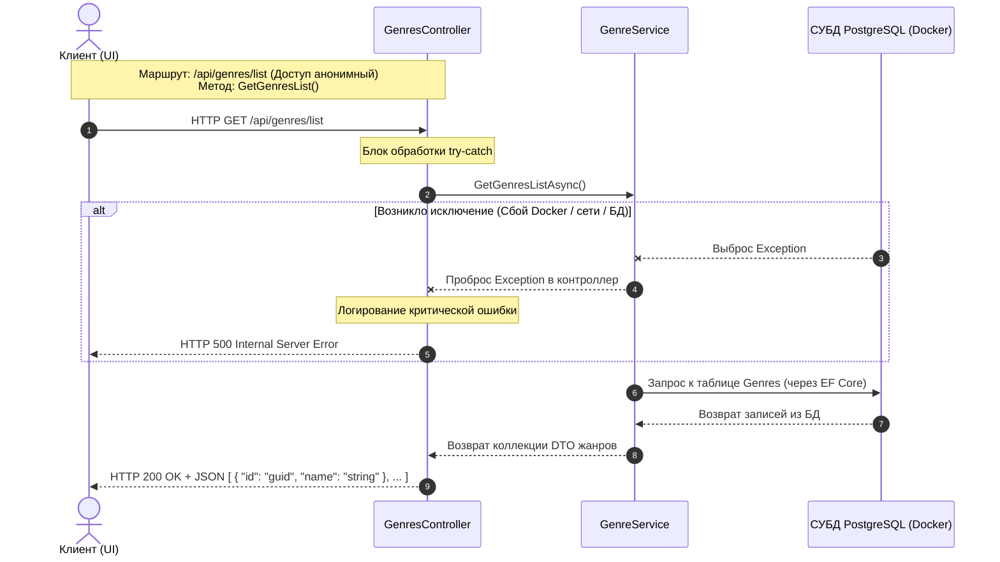
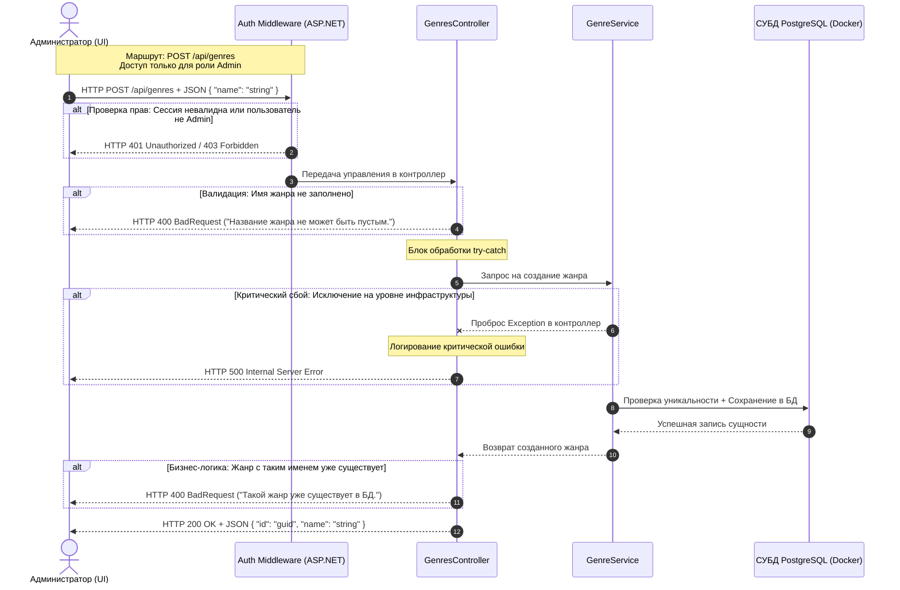
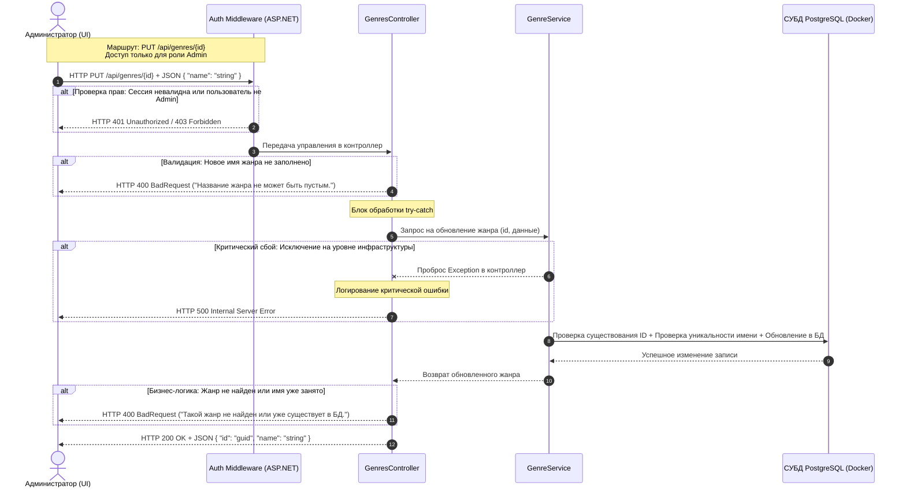
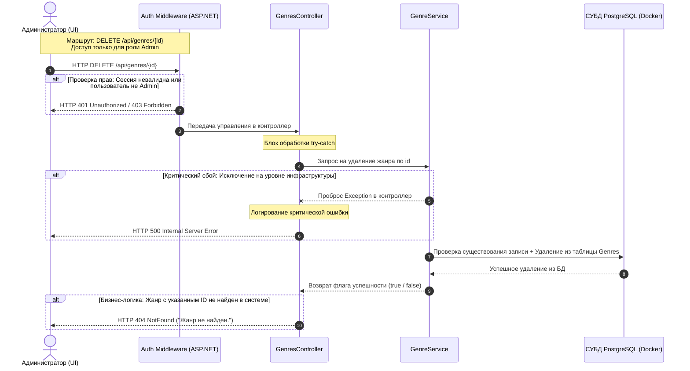

# Управление жанрами (Genres API)

### 1. Получение списка жанров (GET /api/genres/list)

### 2. Добавление нового жанра (POST /api/genres)

### 3. Редактирование жанра (PUT /api/genres/{id})

### 4. Удаление жанра (DELETE/api/genres/{id})

