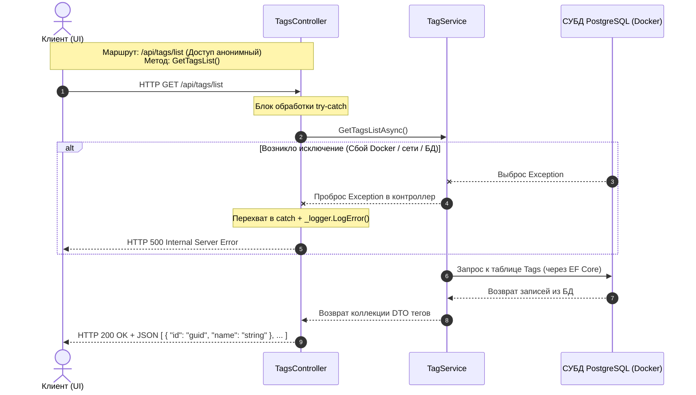
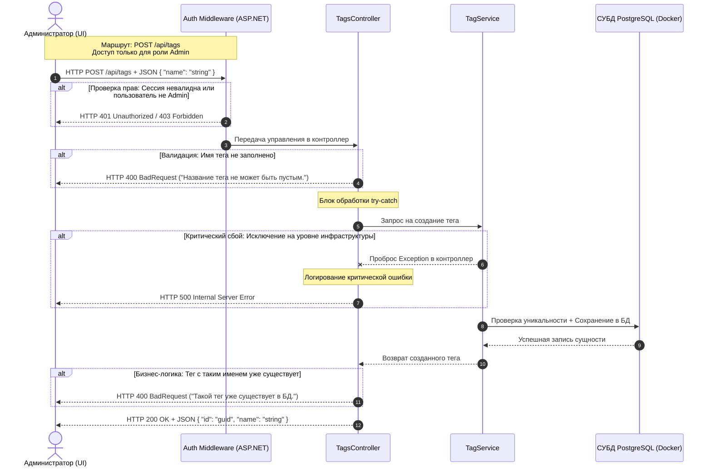
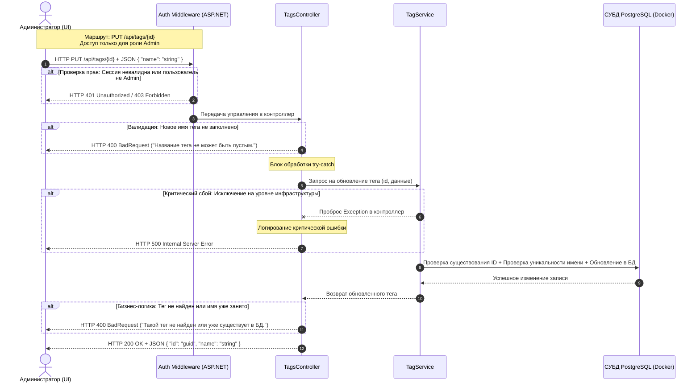
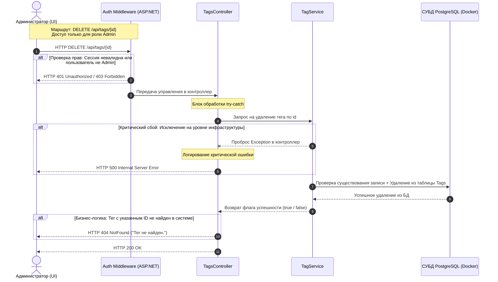

# Управление тегами (Tags API)

### 1. Получение списка тегов (GET /api/tags/list)

### 2. Добавление нового тега (POST /api/tags)

### 3. Редактирование тега (PUT /api/tags/{id})

### 4. Удаление тега (DELETE/api/tags/{id})

