# Архитектура базы данных CinemaStock

## 1. Технологический стек СУБД
* **СУБД:** PostgreSQL (версия 16 или выше).
* **Среда запуска:** Изолированный Docker-контейнер.
* **ORM (Слой доступа к данным):** Entity Framework Core 8/9.
* **Подход к разработке:** Code-First (структура БД полностью генерируется из кода).
* **Управление миграциями:** CLI-утилита `dotnet ef`.

## 3. Структура таблиц (PostgreSQL)

## 3.1. Подробная физическая схема таблиц, полей и связей (ER-Спецификация)

```mermaid
erDiagram
    MediaContents {
        uuid Id PK "PK_MediaContents | NOT NULL"
        character_varying_255 LocalTitle "NULL"
        character_varying_255 OriginalTitle "NOT NULL"
        text Picture "NULL DEFAULT 'images/films/default/default-cover.png'"
        integer Type "NULL DEFAULT 4"
        numeric Rating "NOT NULL DEFAULT 0.0"
        text Description "NULL"
        text SourceInfoFrom "NULL"
        date ReleaseDate "NULL"
        timestamp_with_time_zone CreatedAt "NULL"
        timestamp_with_time_zone UpdatedAt "NULL"
        character_varying_13 Discriminator "NOT NULL"
        integer ReleaseFormatId FK "FK_MediaContents_ReleaseFormat_ReleaseFormatId | NOT NULL"
        integer DurationInMinutes "NULL"
        uuid ReleaseStudioId FK "FK_MediaContents_Companies_ReleaseStudioId | NOT NULL"
    }

    Games {
        uuid Id PK, FK "PK_Games | NOT NULL | 1:1 связь с MediaContents"
        uuid DeveloperId FK "FK_Games_Companies_DeveloperId"
        uuid PublisherId FK "FK_Games_Companies_PublisherId"
    }

    ReleaseFormat {
        integer Id PK "PK_ReleaseFormat | NOT NULL"
        character_varying_50 FormatName "NOT NULL"
    }

    Companies {
        uuid Id PK "PK_Companies | NOT NULL"
        character_varying_255 Name "NOT NULL"
    }

    PlatformsOS {
        uuid Id PK "PK_PlatformsOS | NOT NULL"
        character_varying_100 Name UK "UK_PlatformsOS_Name"
    }

    Genres {
        uuid Id PK "PK_Genres | NOT NULL"
        character_varying_100 Name UK "UK_Genres_Name | NOT NULL"
    }

    Tags {
        uuid Id PK "PK_Tags | NOT NULL"
        character_varying_100 Name UK "UK_Tags_Name | NOT NULL"
    }

    UserMediaProgress {
        integer Id PK "PK_UserMediaProgress (GENERATED BY DEFAULT AS IDENTITY)"
        integer UserId FK "FK_UserMediaProgress_AspNetUsers_UserId | NOT NULL"
        uuid MediaContentId FK "FK_UserMediaProgress_MediaContents_MediaContentId"
        double_precision OwnRate "NULL"
        text MyComment "NOT NULL"
        uuid CinemaContentId FK "FK_UserMediaProgress_MediaContents_CinemaContentId | NOT NULL"
        character_varying_21 Discriminator "NOT NULL"
        integer EpisodeStopWatching "NULL"
        character_varying_50 WatchStatus "NULL"
        character_varying_50 PlayStatus "NULL"
    }

    CustomLists {
        integer Id PK "PK_CustomLists"
        character_varying_255 Name "NOT NULL"
        text Description "NULL"
        integer UserId FK "FK_CustomLists_AspNetUsers_UserId | NOT NULL"
    }

    %% --- ТАБЛИЦЫ СВЯЗЕЙ МНОГИЕ-КО-МНОГИМ ---
    CinemaContentGenre {
        uuid CinemaContentsId PK, FK "PK_CinemaContentGenre | FK_CinemaContentGenre_MediaContents_CinemaContentsId | NOT NULL"
        uuid CinemaGenresId PK, FK "PK_CinemaContentGenre | FK_CinemaContentGenre_Genres_CinemaGenresId | NOT NULL"
    }

    CinemaContentTag {
        uuid CinemaContentId PK, FK "PK_CinemaContentTag | FK_CinemaContentTag_MediaContents_CinemaContentsId | NOT NULL"
        uuid CinemaTagId PK, FK "PK_CinemaContentTag | FK_CinemaContentTag_Tags_CinemaTagsId | NOT NULL"
    }

    GameGenre {
        uuid GameGenresId PK, FK "PK_GameGenre | FK_GameGenre_Genres_GameGenresId | NOT NULL"
        uuid GamesId PK, FK "PK_GameGenre | FK_GameGenre_Games_GamesId | NOT NULL"
    }

    GameTag {
        uuid GameTagsId PK, FK "PK_GameTag | FK_GameTag_Tags_GameTagsId | NOT NULL"
        uuid GamesId PK, FK "PK_GameTag | FK_GameTag_Games_GamesId | NOT NULL"
    }

    GamePlatformOS {
        uuid GamesId PK, FK "PK_GamePlatformOS | FK_GamePlatformOS_Games | NOT NULL"
        uuid PlatformId PK, FK "PK_GamePlatformOS | FK_GamePlatformOS_PlatformsOS | NOT NULL"
    }

    CustomListUserMediaProgress {
        integer CustomListId PK, FK "PK_CustomListUserMediaProgress | FK_CustomListUserMediaProgress_CustomLists_CustomListId | NOT NULL"
        integer UserMediaProgressId PK, FK "PK_CustomListUserMediaProgress | FK_CustomListUserMediaProgress_UserMediaProgress_UserMediaProgressesId | NOT NULL"
    }

    %% --- СИСТЕМНЫЕ ТАБЛИЦЫ IDENTITY ---
    AspNetUsers {
        integer Id PK "PK_AspNetUsers (GENERATED BY DEFAULT AS IDENTITY)"
        timestamp_with_time_zone CreatedAt "NOT NULL"
        character_varying_256 UserName "NULL"
        character_varying_256 NormalizedUserName "NULL"
        character_varying_256 Email "NULL"
        character_varying_256 NormalizedEmail "NULL"
        boolean EmailConfirmed "NOT NULL"
        text PasswordHash "NULL"
        text SecurityStamp "NULL"
        text ConcurrencyStamp "NULL"
        text PhoneNumber "NULL"
        boolean PhoneNumberConfirmed "NOT NULL"
        boolean TwoFactorEnabled "NOT NULL"
        timestamp_with_time_zone LockoutEnd "NULL"
        boolean LockoutEnabled "NOT NULL"
        integer AccessFailedCount "NOT NULL"
    }

    AspNetRoles {
        integer Id PK "PK_AspNetRoles (GENERATED BY DEFAULT AS IDENTITY)"
        character_varying_256 Name "NULL"
        character_varying_256 NormalizedName "NULL"
        text ConcurrencyStamp "NULL"
    }

    AspNetUserRoles {
        integer UserId PK, FK "PK_AspNetUserRoles | FK_AspNetUserRoles_AspNetUsers_UserId | NOT NULL"
        integer RoleId PK, FK "PK_AspNetUserRoles | FK_AspNetUserRoles_AspNetRoles_RoleId | NOT NULL"
    }

    AspNetUserClaims {
        integer Id PK "PK_AspNetUserClaims (GENERATED BY DEFAULT AS IDENTITY)"
        integer UserId FK "FK_AspNetUserClaims_AspNetUsers_UserId | NOT NULL"
        text ClaimType "NULL"
        text ClaimValue "NULL"
    }

    AspNetRoleClaims {
        integer Id PK "PK_AspNetRoleClaims (GENERATED BY DEFAULT AS IDENTITY)"
        integer RoleId FK "FK_AspNetRoleClaims_AspNetRoles_RoleId | NOT NULL"
        text ClaimType "NULL"
        text ClaimValue "NULL"
    }

    AspNetUserLogins {
        text LoginProvider PK "PK_AspNetUserLogins | NOT NULL"
        text ProviderKey PK "PK_AspNetUserLogins | NOT NULL"
        text ProviderDisplayName "NULL"
        integer UserId FK "FK_AspNetUserLogins_AspNetUsers_UserId | NOT NULL"
    }

    AspNetUserTokens {
        integer UserId PK, FK "PK_AspNetUserTokens | FK_AspNetUserTokens_AspNetUsers_UserId | NOT NULL"
        text LoginProvider PK "PK_AspNetUserTokens | NOT NULL"
        text Name PK "PK_AspNetUserTokens"
        text Value "NULL"
    }

    __EFMigrationsHistory {
        character_varying_150 MigrationId PK "PK___EFMigrationsHistory | NOT NULL"
        character_varying_32 ProductVersion "NOT NULL"
    }

    %% --- СВЯЗИ ---
    MediaContents }o--|| ReleaseFormat : ""
    MediaContents }o--o| Companies : "ON DELETE SET NULL"
    Games ||--|| MediaContents : ""
    Games }o--o| Companies : "ON DELETE SET NULL"
    
    UserMediaProgress }o--|| AspNetUsers : "ON DELETE CASCADE"
    UserMediaProgress }o--|| MediaContents : ""
    CustomLists }o--|| AspNetUsers : "ON DELETE CASCADE"

    MediaContents ||--o{ CinemaContentGenre : "ON DELETE CASCADE"
    Genres ||--o{ CinemaContentGenre : "ON DELETE CASCADE"
    
    MediaContents ||--o{ CinemaContentTag : "ON DELETE CASCADE"
    Tags ||--o{ CinemaContentTag : "ON DELETE CASCADE"

    Games ||--o{ GameGenre : "ON DELETE CASCADE"
    Genres ||--o{ GameGenre : "ON DELETE CASCADE"

    Games ||--o{ GameTag : "ON DELETE CASCADE"
    Tags ||--o{ GameTag : "ON DELETE CASCADE"

    Games ||--o{ GamePlatformOS : "ON DELETE CASCADE"
    PlatformsOS ||--o{ GamePlatformOS : "ON DELETE CASCADE"

    CustomLists ||--o{ CustomListUserMediaProgress : "ON DELETE CASCADE"
    UserMediaProgress ||--o{ CustomListUserMediaProgress : "ON DELETE CASCADE"

    AspNetUsers ||--o{ AspNetUserRoles : "ON DELETE CASCADE"
    AspNetRoles ||--o{ AspNetUserRoles : "ON DELETE CASCADE"
    AspNetUsers ||--o{ AspNetUserClaims : "ON DELETE CASCADE"
    AspNetRoles ||--o{ AspNetRoleClaims : "ON DELETE CASCADE"
    AspNetUsers ||--o{ AspNetUserLogins : "ON DELETE CASCADE"
    AspNetUsers ||--o{ AspNetUserTokens : "ON DELETE CASCADE"
```

|||
|-|-|
|**PK**|"Primary Key (Первичный ключ)"|
|**FK**|"Foreign Key (Внешний ключ)"|
|**UK**|"Unique Index / Constraint (Уникальный индекс)"|
|**Discriminator**|"Поле TPH для определения C# класса строки"|

**Discriminator (Дискриминатор)** — системное текстовое поле, создаваемое `Entity Framework Core` для реализации паттерна ***TPH (Table-per-Hierarchy)***. Оно нужно, чтобы разделять разные C#-классы, физически живущие в одной таблице. \
В `MediaContents` (базовый класс) принимает значения `"CinemaContent"` или `"Game"`. \
В `UserMediaProgress` (базовый класс) принимает значения `"UserCinemaProgress"` или `"UserGameProgress"`. \
Анализируя это поле, EF Core автоматически собирает строку из БД в нужный C#-объект.